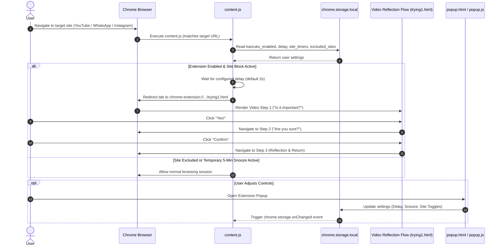

# 🎯 FocusKaoruko - Mindful Browsing Assistant

[](https://developer.chrome.com/docs/extensions/mv3/intro/)
[](https://developer.mozilla.org/en-US/docs/Web/JavaScript)
[](LICENSE)
[]()

**FocusKaoruko** is an interactive Manifest V3 Chrome Extension engineered to curb impulsive, absent-minded social media browsing. By introducing customizable delay timers, granular site controls, snooze modes, and a multi-step video reflection sequence ("Is it important?"), FocusKaoruko builds intentional friction to help you stay focused on what truly matters.

---

## 💡 Problem & Executive Summary

### The Problem
When opening distracting sites like YouTube, WhatsApp, or Instagram out of habit, dopamine loops kick in automatically before your rational brain has a chance to evaluate whether visiting the site is actually necessary.

### The Solution
FocusKaoruko intercedes during the critical 2–5 second window after navigating to a target URL. Before allowing access, it redirects the browser tab to an interactive 3-step video confirmation sequence ("Is it important?" $\rightarrow$ "Are you sure?" $\rightarrow$ Final Reflection). This cognitive breathing room breaks passive browsing loops and restores conscious decision-making.

---

## 🏗️ System Architecture & Execution Flow



---

## 🚀 Feature Matrix

| Feature | Description | Status |
| :--- | :--- | :---: |
| **Interactive Video Friction Flow** | 3-stage video reflection sequence (`k1.mp4` $\rightarrow$ `k2.mp4` $\rightarrow$ `k3.mp4`) that challenges impulse clicks. | ✅ Active |
| **Granular Site Controls** | Toggle blocking independently for YouTube, WhatsApp Web, and Instagram. | ✅ Active |
| **Custom Delay Slider** | Adjust redirection delay from `0` to `10` seconds. | ✅ Active |
| **5-Minute Snooze Timer** | Temporarily unblock a specific site or disable the extension with auto-resume countdown. | ✅ Active |
| **Site Exclusion Mode** | Exclude target sites permanently from redirection while leaving extension active for others. | ✅ Active |
| **Glassmorphism UI** | Modern dark glass popup control interface built with Vanilla CSS. | ✅ Active |

---

## 📁 Repository Directory Structure

| File / Folder | Purpose |
| :--- | :--- |
| [`manifest.json`](file:///d:/Y2/Extensions/Kaoruko_Extension/manifest.json) | Chrome Extension Manifest V3 configuration & permission declarations. |
| [`content.js`](file:///d:/Y2/Extensions/Kaoruko_Extension/content.js) | Content script injected into target websites to monitor URLs & initiate redirection. |
| [`popup.html`](file:///d:/Y2/Extensions/Kaoruko_Extension/popup.html) | Extension popup interface featuring glassmorphic controls and status toggles. |
| [`popup.js`](file:///d:/Y2/Extensions/Kaoruko_Extension/popup.js) | Event handlers and chrome storage state synchronization for popup UI. |
| [`trying1.html`](file:///d:/Y2/Extensions/Kaoruko_Extension/trying1.html), [`trying2.html`](file:///d:/Y2/Extensions/Kaoruko_Extension/trying2.html), [`trying3.html`](file:///d:/Y2/Extensions/Kaoruko_Extension/trying3.html) | Multi-step interactive video friction pages. |
| [`t1.js`](file:///d:/Y2/Extensions/Kaoruko_Extension/t1.js), [`t2.js`](file:///d:/Y2/Extensions/Kaoruko_Extension/t2.js), [`t3.js`](file:///d:/Y2/Extensions/Kaoruko_Extension/t3.js) | Step transition logic triggered after video playback ends. |
| [`k1.mp4`](file:///d:/Y2/Extensions/Kaoruko_Extension/k1.mp4), [`k2.mp4`](file:///d:/Y2/Extensions/Kaoruko_Extension/k2.mp4), [`k3.mp4`](file:///d:/Y2/Extensions/Kaoruko_Extension/k3.mp4) | High-resolution video assets for reflection prompts. |
| [`package.json`](file:///d:/Y2/Extensions/Kaoruko_Extension/package.json) | Standalone Node package manifest with maintenance scripts (`lint`, `format`, `zip`). |
| [`.gitignore`](file:///d:/Y2/Extensions/Kaoruko_Extension/.gitignore) | Git exclusion patterns for isolated clutter, OS files, and build outputs. |
| [`_archive_clutter/`](file:///d:/Y2/Extensions/Kaoruko_Extension/_archive_clutter/) | Isolated repository folder for non-production development artifacts. |

---

## 🛠️ Quickstart & Installation Guide

### Prerequisites
- Google Chrome, Chromium, or Brave Browser (Version 88+ for Manifest V3 support).
- Node.js (v18+) *[Optional, for building/linting package]*

### Installation (Developer Mode)
1. **Clone or Download Repository**:
   ```bash
   git clone https://github.com/Mayank-CS50/focus-kaoruko.git
   cd focus-kaoruko
   ```
2. **Open Chrome Extension Management**:
   Navigate to `chrome://extensions` in your browser address bar.
3. **Enable Developer Mode**:
   Toggle the **Developer mode** switch in the top right corner.
4. **Load Unpacked Extension**:
   Click **Load unpacked** and select the `focus-kaoruko` project directory.
5. **Pin & Test**:
   Pin **FocusKaoruko** to your Chrome toolbar, open YouTube or WhatsApp Web, and observe the intentional reflection flow!

---

## 🧪 Verification, Linting & Build Instructions

### Package Packaging Script
To package the extension into a standalone `.zip` distribution ready for Chrome Web Store submission:
```bash
npm run zip
```
This generates `focus-kaoruko-v1.4.0.zip` in the root folder.

### Code Formatting & Quality
```bash
# Format codebase with Prettier
npm run format

# Run ESLint on JavaScript files
npm run lint
```

---

## 💡 Suggested GitHub Repository Names

1. **`focus-kaoruko`** *(Recommended)*
2. **`kaoruko-focus-extension`**
3. **`focus-shield-kaoruko`**
4. **`mindful-browse-kaoruko`**
5. **`kaoruko-distraction-blocker`**

---

## 📄 License

This project is licensed under the **MIT License**. See the `LICENSE` file for details.
